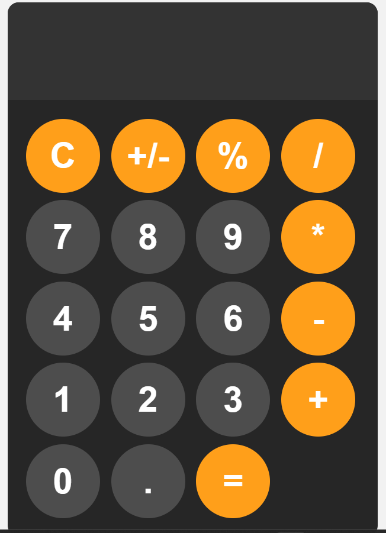

# Calculator

A simple web-based calculator built using HTML, CSS, and JavaScript.



## Table of Contents
- [Features](#features)
- [Installation](#installation)
- [Usage](#usage)
- [Contributing](#contributing)
- [License](#license)

## Features
- Basic arithmetic operations: addition, subtraction, multiplication, division.
- Percentage calculation.
- Clear input (C) functionality.
- Responsive design with a clean and modern interface.
- Hover and active states for buttons to enhance user interaction.

## Installation
1. Clone the repository to your local machine:
    ```bash
    git clone https://github.com/your-username/calculator.git
    ```
2. Navigate to the project directory:
    ```bash
    cd calculator
    ```
3. Open `index.html` in your preferred web browser to use the calculator.

## Usage
- Click on the buttons to perform calculations.
- Use the `C` button to clear the display.
- The `+/-` button toggles the sign of the number.
- The `%` button calculates the percentage.
- The `=` button computes the result of the entered expression.

## Project Structure
- `index.html` - The main HTML file that includes the structure of the calculator.
- `style.css` - The CSS file responsible for the styling of the calculator.
- `index.js` - The JavaScript file containing the logic for the calculator's functionality.

## Contributing
Contributions are welcome! If you'd like to contribute to this project, please fork the repository and submit a pull request. Make sure to provide a detailed description of your changes.


